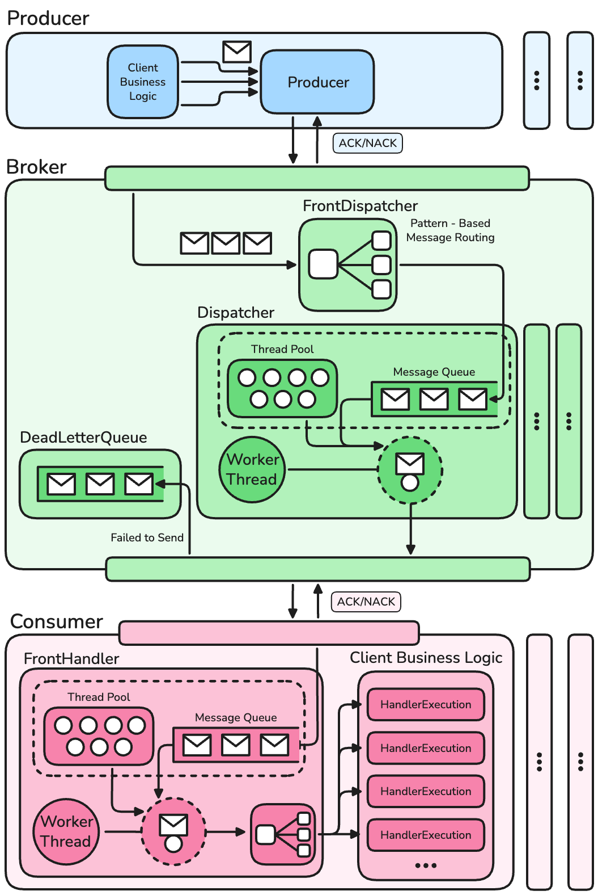

<!-- @formatter:off -->
# MMMQ (Moko-Meringue's Message Queue)

# 🎯 프로젝트 목적

**MMMQ**는 메시지 큐 시스템의 핵심 개념과 동작 원리를 학습하기 위한 프로젝트입니다.

- 단순히 도구를 사용하는 것을 넘어, 메시지 브로커의 존재 이유와 동작 메커니즘을 근본적으로 이해합니다.
- 큐 자료구조부터 메시지 영속화, 동시성 제어까지 바닥부터 직접 쌓아 올립니다.
- 오픈 소스 방식의 협업과 피드백을 통해 '함께 성장하는 소프트웨어'를 지향합니다.

# 🏗️ 아키텍처

## 시스템 흐름



Producer는 메시지를 생성하여 Broker로 전송합니다.
Broker는 메시지를 큐에 저장하고, Consumer가 메시지를 요청할 때 이를 전달합니다.
만약 메시지 처리에 실패하면, 메시지는 Dead Letter Queue로 이동하여 별도로 관리됩니다.
Dead Letter Queue에 저장된 메시지는 디스크에 나중에 재처리하거나 분석할 수 있습니다.

## 주요 컴포넌트

### Producer

`Producer`는 메시지를 생성하고 브로커에게 전송합니다. 토픽과 함께 메시지를 발행할 수 있으며, 전송 실패 시 설정된 횟수만큼 재시도를 수행합니다.  
  
### Broker

`Broker`는 Producer로부터 메시지를 받아 Consumer에게 전달합니다. 메시지 수신을 위한 엔드포인트를 제공하며, `FrontDispatcher`를 통해 메시지를 적절한 `Dispatcher`에게 전달합니다.  
  
`FrontDispatcher`는 Broker로 들어온 메시지의 토픽을 분석하여 해당 토픽을 구독 중인 모든 `Dispatcher`에게 메시지를 분배합니다.  
  
`Dispatcher`는 메시지 큐를 관리하고 Consumer에게 메시지를 전달합니다. 각 Consumer마다 별도의 `Dispatcher`가 할당되며, 내부적으로 `BlockingQueue`를 사용하여 메시지를 관리합니다. 각 `Dispatcher`는 독립된 스레드 풀을 소유하여 특정 Consumer의 느린 메시지 소비가 다른 Consumer에게 영향을 미치는 **느린 소비자 문제**를 해결합니다.

`Dispatcher`는 `Pattern` 객체를 사용하여 토픽과 바인딩됩니다. `Pattern`은 Ant 기반의 경로 패턴 매칭을 지원하여 유연한 토픽 구독이 가능합니다. 와일드카드(*)를 사용하여 유연한 토픽 구독이 가능합니다.

> 예: `Pattern("order.*")` 을 소유한 `Dispatcher`는 `order.new`도 핸들링할 수 있습니다.

`Dispatcher`는 메시지 전송에 실패한 경우 3번 재전송을 수행하며, 최종적으로 실패할 경우 `DeadLetterQueue`로 메시지를 전달합니다.
  
`DeadLetterQueue`는 메시지 전송에 최종적으로 실패했을 때 해당 메시지를 처리합니다. 전송 실패 원인과 함께 메시지를 `DeadLetter`로 포장하여 저장함으로써, 추후 분석 및 복구를 지원합니다. 재시도 횟수 초과, 처리 불가 예외 발생 등 다양한 실패 상황에 대응합니다.  
  
### Consumer

`FrontHandler`는 수신한 메시지의 토픽을 분석하여 해당 토픽을 구독 중인 모든 `HandlerExecution`들을 찾아 실행합니다.  
  
`HandlerExecution`은 어노테이션 기반(`@MMMQListener`)과 인터페이스 구현(`MMMQHandler`) 방식을 모두 동일한 방식으로 처리할 수 있도록 추상화된 메시지 핸들러 실행부입니다. 이를 통해 다양한 방식의 메시지 핸들러 실행부의 일관성을 유지하고 확장성을 높입니다.  
  
`@MMMQListener` 어노테이션을 사용하면 메서드에 `@MMMQListener(pattern = "...")`를 붙여 메시지 핸들러를 지정할 수 있습니다. Spring의 `@EventListener`처럼, 선언적으로 특정 토픽의 메시지를 처리할 메서드를 간편하게 등록할 수 있습니다.  
  
`MMMQListener` 인터페이스를 구현하여 메시지 핸들러를 구현할 수도 있습니다. 컴파일 타임에 타입 안정성을 제공하며, 복잡한 메시지 처리 로직을 구현할 때 유용합니다.

`@MMMQListener` 어노테이션과 `MMMQListener` 인터페이스는 경로 패턴(Ant 기반)을 기반으로 토픽을 핸들링할 수 있습니다. 와일드카드(*)를 사용하여 유연한 토픽 구독이 가능합니다.

> 예: `@MMMQListener(pattern = "order.*")` 는 `order.new`도 핸들링할 수 있습니다.
  

# 🚀 시작하기

## 최소 버전 요구사항

- Java 17 이상
- Spring Boot 3.2.0 이상
- Spring Web (spring-boot-starter-web 의존성 포함)

## 의존성 추가 (build.gradle)

```
repositories {
    maven { url "https://jitpack.io" }
    mavenCentral()
}

dependencies {
    ...
    
    implementation 'com.github.moko-meringue.mmmq:{모듈}:{버전}'
    
    // Broker 모듈 의존성 추가
    // implementation 'com.github.moko-meringue.mmmq:broker:{버전}'
    
    // Consumer 모듈 의존성 추가
    // implementation 'com.github.moko-meringue.mmmq:consumer:{버전}'
    
    // Producer 모듈 의존성 추가
    //implementation 'com.github.moko-meringue.mmmq:producer:{버전}'
}
```

## 설정을 위한 빈 등록

### Producer 설정

Producer는 Broker에 메시지를 전송합니다. Producer Bean을 등록하고 Broker의 주소를 Host 객체로 전달해야 합니다.

```java
@Configuration
public class ProducerConfig {

    @Bean
    public Producer orderProducer() {
        Host brokerHost = new Host("http", "ip", 8080); // Broker의 호스트 정보
        return new Producer(brokerHost);
    }
}
```

### Consumer 설정

Consumer는 Broker로부터 메시지를 수신하여 처리합니다.
`@MMMQListener` 어노테이션 또는 `MMMQHandler` 인터페이스를 사용하여 메시지 핸들러를 등록할 수 있습니다.

#### 방법 1: 어노테이션(@MMMQListener) 사용
메서드에 어노테이션을 붙여 간편하게 특정 토픽을 구독하는 핸들러를 만들 수 있습니다.
값 생략 시, 모든 패턴을 핸들링합니다.

```java
@Service
public class OrderService {
    
    // ...
    
    @MMMQListener("order.*") // order.* 토픽을 핸들링
    public void handleAllOrders(Order order) {
        // Handle all orders
    }
}
```

#### 방법 2: 인터페이스(MMMQListener) 구현

`MMMQHandler` 인터페이스를 구현하여 클래스 단위로 핸들러를 정의할 수 있습니다.

```java
@Service
public class OrderService implements MMMQListener<Order>{

    // ...
    
    @Override
    public Pattern listens() {
        return new Pattern("order.*"); // order.* 토픽을 핸들링
    }

    @Override
    public void handle(Order order) {
        // Handle all orders
    }
}
```


### Broker 설정

Broker는 어떤 Consumer에게 메시지를 전달할지 알아야 합니다.
Dispatcher Bean을 등록하여 Consumer의 주소와 바인딩할 토픽의 패턴을 설정합니다.

```java
@Configuration
public class DispatcherConfig {

    @Bean
    public Dispatcher orderDispatcher() {
        return new Dispatcher(
                "order-dispatcher", // Dispatcher 이름
                new Host("http", "ip", 8080), // Consumer의 호스트 정보
                List.of(new Pattern("order.*"), new Pattern("payment.kakao.*")), // 바인딩할 토픽 패턴 리스트
                new TimerDeadLetterQueue( // Dead Letter Queue 설정
                        "order-dead-letter-queue", // Dead Letter Queue 이름
                        new DeadLetterFileWriter( // Dead Letter Writer 설정
                                Path.of("/home/ubuntu/dead-letters"), // 파일 저장 경로
                                "order-dead-letter-writer" // Dead Letter Writer 이름
                        ),
                        60_000 // Dead Letter Write 주기 (밀리초 단위)
                )
        );
    }
}
```

# 👥 참여자

모든 코드는 모코와 머랭의 **페어 프로그래밍**으로 작성되었습니다.

<div align="center">
<table>
  <tr height="140px">
    <td align="center">
      <a href="https://github.com/cookie-meringue">
        
      </a>
      <br />
      <a href="https://github.com/cookie-meringue">머랭</a>
    </td>
      <td align="center">
      <a href="https://github.com/songsunkook">
        
      </a>
      <br />
      <a href="https://github.com/songsunkook">모코</a>
    </td>
  </tr>
</table>
</div>

# ⚖️ 라이선스

이 프로젝트는 교육 목적으로 제작되었습니다.
