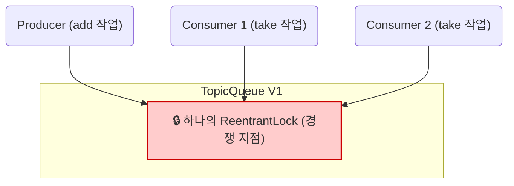
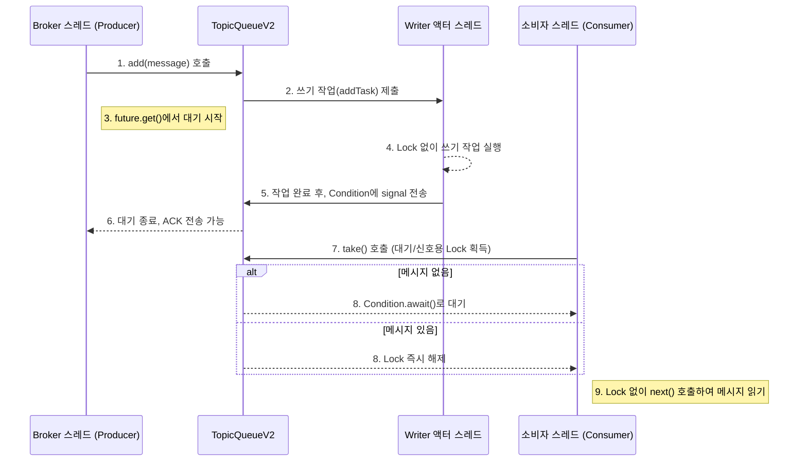

# TopicQueue 성능 개선을 위한 신규 아키텍처 제안

## 1. 개요
현재 MMMQ 시스템의 핵심 구성 요소인 `TopicQueue`는 높은 동시성 환경에서 성능 저하를 일으킬 수 있는 잠재적인 병목 지점을 가지고 있습니다. 본 문서는 현재 `TopicQueue`의 동작 방식을 분석하고, 이를 개선하기 위한 새로운 '액터 모델' 기반의 `TopicQueueV2` 아키텍처를 제안하며, 두 방식의 장단점 및 기대 효과를 기술합니다.

---

## 2. 기존 방식 (V1: 공유 락 모델) 분석

### 2.1. 동작 원리
현재 `TopicQueue`는 `java.util.concurrent.locks.ReentrantLock`을 사용하여 동시성을 제어합니다.
- **하나의 Lock:** 메시지를 추가하는 생산자(Producer) 스레드와 메시지를 읽어가는 소비자(Consumer) 스레드 모두가 **동일한 Lock**을 획득해야만 큐의 데이터에 접근할 수 있습니다.
- **경쟁적 접근:** 생산자가 `add()`를 호출하거나 소비자가 `take()`(내부적으로 `hasNext()`)를 호출할 때, 먼저 Lock을 획득한 스레드만 작업을 수행하며 나머지 스레드는 대기해야 합니다. 즉, 모든 작업이 Lock이라는 단일 지점에서 직렬화됩니다.

#### 생산/소비 파이프라인

### 2.2. 장점과 단점

-   **장점**
    -   **구현의 단순성:** 단일 Lock을 사용하는 것은 동시성 제어의 전형적인 패턴으로, 비교적 이해하고 구현하기 쉽습니다.
    -   **데이터 무결성 보장:** 올바르게 사용될 경우 데이터의 일관성을 확실하게 보장합니다.

-   **단점**
    -   **Lock 경쟁으로 인한 성능 저하:** 시스템의 모든 처리량이 단일 Lock에 의해 제한됩니다. 생산자와 소비자가 많아질수록 Lock을 얻기 위한 경쟁은 심해지고, 스레드가 대기하는 시간이 늘어나 전체 처리량이 급격히 떨어집니다.
    -   **읽기/쓰기 작업의 강한 결합:** 읽기 작업이 오래 걸리면 쓰기 작업이 지연되고, 쓰기 작업이 오래 걸리면 읽기 작업이 지연됩니다. 즉, 느린 소비자가 전체 시스템의 발목을 잡을 수 있습니다.

---

## 3. 새로운 방식 (V2: 액터 모델) 제안

### 3.1. 동작 원리
새로운 `TopicQueueV2`는 '쓰기'와 '읽기'의 역할을 명확히 분리하여 Lock 경쟁을 최소화하는 액터(Actor) 모델 기반으로 동작합니다.

-   **쓰기 경로(Write Path) 분리:**
    -   모든 쓰기 작업(`add`, 큐 구조 변경)은 전용 **단일 스레드 실행자(Writer 액터)** 에게 위임됩니다.
    -   Writer 액터는 자신만의 작업 큐를 가지며, 들어온 요청을 순차적으로 처리합니다. 따라서 쓰기 작업끼리는 Lock이 전혀 필요 없습니다. (Thread Confinement)
    -   Broker는 `future.get()`을 통해 쓰기 작업이 **완전히 완료되었음을 보장**받은 후 Producer에게 ACK를 보낼 수 있습니다.

-   **읽기 경로(Read Path) 분리:**
    -   소비자 스레드는 메시지가 없을 때 대기하기 위한 목적으로만 `Lock`과 `Condition`을 사용합니다.
    -   실제 메시지를 읽어가는 `next()` 작업은 `Lock` 없이(lock-free) 수행되어 성능을 극대화합니다.

-   **쓰기/읽기 간의 소통:**
    -   Writer 액터는 쓰기 작업을 완료한 후, 대기 중인 소비자들에게 `signalAll()`을 통해 "새 메시지가 도착했다"는 신호만 보내줍니다.

#### 생산/소비 파이프라인

### 3.2. 기존 방식의 문제 해결
이 새로운 방식은 기존 방식의 '단일 Lock 경쟁'이라는 근본적인 문제를 해결합니다. 쓰기 경로는 더 이상 읽기 경로에 의해 방해받지 않으며, 독립적으로 최고 성능을 유지할 수 있습니다.

### 3.3. 장점과 단점

-   **장점**
    -   **압도적인 쓰기 처리량:** 소비자 수에 관계없이 쓰기 성능이 일정하게 유지됩니다.
    -   **높은 확장성:** 소비자가 늘어나도 Lock 경쟁이 없어 시스템 전체의 성능 저하가 거의 없습니다.
    -   **안정성 및 예측 가능성:** 역할 분리가 명확하여 코드를 이해하기 쉽고, 동시성 버그 발생 가능성이 적으며, 시스템 성능을 예측하기 용이합니다.

-   **단점**
    -   **설계의 복잡성 증가:** `ExecutorService`, `Future` 등 더 많은 동시성 컴포넌트가 사용되어 초기 설계가 더 복잡합니다.
    -   **자원 관리의 필요성:** `ExecutorService`의 생명주기(`shutdown`)를 명시적으로 관리해야 합니다.

---

## 4. 기존 방식(V1) vs 새로운 방식(V2) 비교

| 항목 | V1: 공유 락 모델 | V2: 액터 모델 |
| :--- | :--- | :--- |
| **동시성 전략** | 단일 `ReentrantLock`을 통한 완전 직렬화 | 쓰기(액터)와 읽기(대기/신호) 경로 분리 |
| **Lock 경쟁** | 높음 (모든 스레드가 단일 Lock 경쟁) | 낮음 (대기/신호 시점에만 잠깐 발생) |
| **쓰기/읽기 결합도** | **높음** (서로가 서로를 블로킹함) | **낮음** (서로에게 거의 영향을 주지 않음) |
| **쓰기 성능** | 소비자 수에 반비례하여 저하 | 소비자 수와 무관하게 **일정하게 높음** |
| **확장성** | 낮음 | **높음** |
| **코드 복잡성** | 낮음 | 중간 |
| **병목 지점** | **단일 Lock** | 없음 (이론적으로) |

---

## 5. 기대 효과

-   **기존 문제 해결:**
    -   V1의 **'단일 Lock 경쟁'** 문제는 V2의 **'쓰기/읽기 경로 분리'**를 통해 해결됩니다.
    -   V1의 **'소비자 수 증가에 따른 성능 저하'** 문제는 V2의 **'일정한 쓰기 처리량'** 보장을 통해 해결됩니다.
-   **기대할 수 있는 점:**
    -   **메시지 처리량(Throughput) 극대화:** Broker가 더 빠르고 안정적으로 메시지를 수용하고 분배할 수 있습니다.
    -   **시스템 안정성 향상:** 특정 소비자의 성능 문제가 전체 시스템에 파급되는 것을 방지하여, 더 견고하고 예측 가능한 시스템을 구축할 수 있습니다.
    -   **향후 확장 용이성:** 역할이 명확히 분리된 구조는 추후 새로운 기능을 추가하거나 변경할 때 더 유연하게 대처할 수 있습니다.

---

## 6. 가상 스레드(Virtual Threads)와의 시너지

Java 21의 가상 스레드는 우리가 논의한 아키텍처에 엄청난 시너지 효과를 가져다줄 수 있습니다. 가상 스레드는 I/O 작업이나 `Blocking`으로 인해 대기하는 시간에 OS 스레드를 낭비하지 않는 매우 가벼운 스레드입니다.

### 소비자(Consumer) 확장성 극대화

-   **문제:** 현재 `Dispatcher`의 각 소비자 워커는 하나의 OS 스레드(Platform Thread)를 점유할 가능성이 높습니다. 수백, 수천 개의 토픽을 구독해야 한다면, 그만큼의 OS 스레드를 생성해야 하므로 시스템에 큰 부담이 됩니다. 특히 `take()`에서 메시지를 기다리며 `await()`하는 동안 이 비싼 OS 스레드들은 아무 일도 하지 않고 자원만 낭비하게 됩니다.
-   **해결:** 소비자를 가상 스레드로 실행하면, `await()`로 대기하는 동안 JVM이 해당 가상 스레드를 OS 스레드에서 분리(unmount)하고, 그 OS 스레드는 다른 작업을 처리할 수 있습니다. 즉, **수천 개의 소비자가 대기하더라도 극소수의 OS 스레드만으로 모두 감당**할 수 있게 됩니다. 이는 소비자 측의 확장성을 거의 무한에 가깝게 만들어 줍니다.

### 생산자(Producer) 응답성 향상

-   **문제:** V2 액터 모델의 `add()` 메서드는 `future.get()`을 통해 동기적으로 대기합니다. 만약 이 메서드를 호출하는 Broker의 HTTP 요청 처리 스레드가 OS 스레드라면, 대기 시간 동안 해당 스레드는 다른 HTTP 요청을 전혀 처리할 수 없습니다.
-   **해결:** Broker의 웹 서버(예: Tomcat)가 요청마다 가상 스레드를 사용하도록 설정하면, `add()`에서 대기하는 스레드는 가상 스레드가 됩니다. 이 스레드는 대기하는 동안 OS 스레드를 점유하지 않으므로, 웹 서버는 한정된 OS 스레드 자원으로 훨씬 더 많은 동시 요청을 효율적으로 처리할 수 있게 됩니다.

### V2 액터 모델 + 가상 스레드 = 최적의 조합

-   **V2 액터 모델**은 `Lock` 경쟁을 제거하여 **CPU 병목 현상**을 해결합니다.
-   **가상 스레드**는 `Blocking` 대기 시간을 효율적으로 처리하여 **I/O 및 대기 병목 현상**을 해결합니다.

이 두 가지가 결합되면, CPU와 I/O를 모두 극도로 효율적으로 사용하는, 높은 확장성과 처리량을 갖춘 이상적인 메시지 큐 시스템을 구축할 수 있습니다. V2 아키텍처는 `future.get()`, `condition.await()`과 같은 표준 Blocking API를 사용하므로, 별도의 코드 수정 없이 가상 스레드 환경에서 즉시 최고의 성능을 발휘할 수 있습니다.

---

## 7. 성능 테스트를 통한 도입 제안

새로운 아키텍처가 이론적으로 많은 이점을 제공하지만, 실제 시스템에 도입하기 전에는 반드시 정량적인 데이터에 기반한 검증이 필요합니다.

### 제안 프로세스
1.  현재의 `TopicQueue`(V1)와 새로운 `TopicQueueV2`를 모두 유지합니다.
2.  두 구현체를 동일한 조건 하에서 벤치마킹하는 성능 테스트 스위트를 구축합니다.
3.  테스트 시나리오:
    -   1 생산자 / 1 소비자
    -   1 생산자 / 100 소비자 (소비자가 많을 때 V1의 성능 저하 확인)
    -   10 생산자 / 10 소비자 (다중 생산자 경쟁 상황)
4.  테스트 결과를 바탕으로 `V2` 도입의 실효성을 평가하고, 최종 도입을 결정합니다.

### 성능 측정 방법
-   **JMH (Java Microbenchmark Harness):**
    -   자바 코드의 마이크로 벤치마킹을 위한 표준 도구입니다. JVM의 워밍업, 데드 코드 제거 등 각종 최적화 효과를 고려하여 정확한 성능 측정이 가능합니다.
    -   `@Benchmark` 어노테이션을 사용하여 `add()`와 `take()` 메서드의 처리량(ops/sec), 평균 응답 시간 등을 측정할 수 있습니다.
-   **프로파일링 도구 (perf, VisualVM, JProfiler 등):**
    -   벤치마크 결과의 'Why'를 분석하기 위해 사용합니다.
    -   **Lock Contention:** 어떤 Lock에서 얼마나 많은 스레드가 경쟁하고 대기하는지 시각적으로 확인할 수 있습니다. (V1에서 높고 V2에서 낮게 측정될 것으로 기대)
    -   **CPU 사용률 및 스레드 상태:** 각 스레드가 '실행(Running)', '대기(Waiting)', '블로킹(Blocked)' 중 어떤 상태에 주로 머무르는지 분석하여 병목 지점을 찾을 수 있습니다.
    -   **perf (Linux):** 시스템 레벨의 성능 분석 도구로, Context Switching, CPU 사이클 등 하드웨어 수준의 상세한 데이터를 제공합니다.
